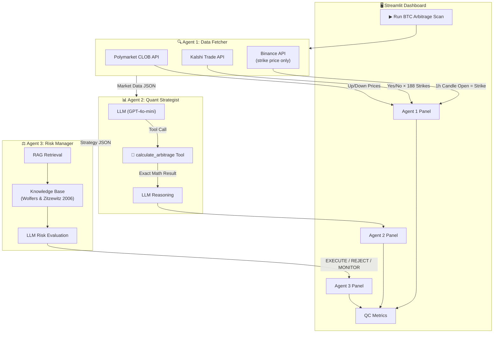

# ₿TC Arbitrage Scanner

**Live cross-exchange arbitrage intelligence for Bitcoin hourly prediction markets.**

Scans Polymarket and Kalshi in real-time, identifies risk-free arbitrage opportunities using deterministic math, and validates strategies against academic research via RAG.

[](https://streamlit.io)
[](https://python.org)
[](https://openai.com)

---

## Architecture

The system uses a **3-agent agentic pipeline** with tool calling and RAG retrieval:



---

## How It Works

### Agent 1: Data Fetcher
Fetches live market data from two prediction market platforms:
- **Polymarket** — "Bitcoin Up or Down" hourly event (names by candle **open** hour)
- **Kalshi** — "Bitcoin price at..." hourly event (names by candle **close** hour)

Polymarket's strike price is derived from the Binance BTCUSDT 1-hour candle open price (fetched automatically behind the scenes).

> ℹ️ Both platforms resolve the **same hourly candle**. Polymarket names by the open hour (e.g., "11PM"), Kalshi by the close hour (e.g., "12AM"). The data fetcher accounts for this with a +1h offset on the Kalshi ticker.

### Agent 2: Quant Strategist (Tool Calling)
Uses **OpenAI function calling** with a `calculate_arbitrage` tool:
1. LLM receives the market data and calls the tool with the parameters
2. The tool runs **deterministic Python math** — iterates all Kalshi strikes, finds the optimal pair
3. Tool result is fed back to the LLM for qualitative reasoning
4. Python enforces the tool's exact numbers into the final output (prevents hallucinated arithmetic)

**Arbitrage Logic:**
| Condition | Strategy | Cost |
|---|---|---|
| `Poly_Strike > Kalshi_Strike` | Buy Poly DOWN + Kalshi YES | `down_price + yes_price` |
| `Poly_Strike < Kalshi_Strike` | Buy Poly UP + Kalshi NO | `up_price + no_price` |
| `Poly_Strike == Kalshi_Strike` | Check both combos | min of both |

**If total cost < $1.00 → risk-free arbitrage** (guaranteed $1.00 payout minus cost = profit).

### Agent 3: Risk Manager (RAG)
- Retrieves academic context from a local knowledge base (Wolfers & Zitzewitz, 2006)
- Evaluates the proposed trade against the **favorite-longshot bias** and fee structure
- Issues a final verdict: `EXECUTE`, `MONITOR`, or `REJECT`
- Applies the academic framework only to extreme-probability contracts (< $0.10 or > $0.90)

---

## Live Spread Equation

The dashboard displays the exact equation the decision is based on:

```
Polymarket UP ($0.428) + Kalshi NO ($0.700)
= $1.1280  ❌ ≥ $1.00
Guaranteed Loss = $1.00 - $1.1280 = $-0.1280
```

When an arbitrage exists:
```
Polymarket UP ($0.430) + Kalshi NO ($0.420)
= $0.8500  ✅ < $1.00
Guaranteed Profit = $1.00 - $0.8500 = $0.1500
```

---

## Quality Control & Validation

The pipeline tracks QC metrics for every run:
- **Total Latency** — End-to-end pipeline execution time
- **Collector Validation** — Both APIs returned valid data
- **Quant LLM Schema** — Agent 2 returned valid JSON with correct fields
- **Risk LLM Schema** — Agent 3 returned valid JSON with a decision

All agent outputs are validated against expected schemas. The deterministic `calculate_arbitrage` tool ensures arithmetic accuracy regardless of LLM behavior.

---

## Setup

### Prerequisites
- Python 3.10+
- OpenAI API key (for GPT-4o-mini) **or** Ollama running locally

### Installation

```bash
git clone https://github.com/datik01/btc_arb_scanner.git
cd btc_arb_scanner

pip install -r requirements.txt
```

### Environment Variables

Create a `.env` file:

```env
OPENAI_API_KEY=sk-proj-...
```

### Run

```bash
streamlit run app.py
```

---

## Project Structure

```
├── app.py              # Streamlit dashboard UI
├── agents.py           # 3-agent pipeline (Collector → Quant → Risk)
├── data_fetcher.py     # Polymarket, Kalshi, Binance API integrations
├── rag.py              # RAG retrieval from academic knowledge base
├── build_kb.py         # Knowledge base builder (Wolfers & Zitzewitz 2006)
├── requirements.txt    # Python dependencies
├── .env                # API keys (not committed)
└── .streamlit/         # Streamlit theme configuration
```

---

## Academic Foundation

This system is grounded in prediction market research:

> **Wolfers, J., & Zitzewitz, E. (2006).** *Prediction Markets in Theory and Practice.* NBER Working Paper 12083.

Key insights applied:
- **Favorite-longshot bias** — Extreme-probability contracts (< $0.10 or > $0.90) are systematically mispriced
- **Cross-exchange arbitrage** — Price discrepancies between platforms create exploitable spreads
- **Fee drag** — Kalshi charges ~3-7% on winnings; spreads must exceed this threshold to be profitable

---

## License

MIT
